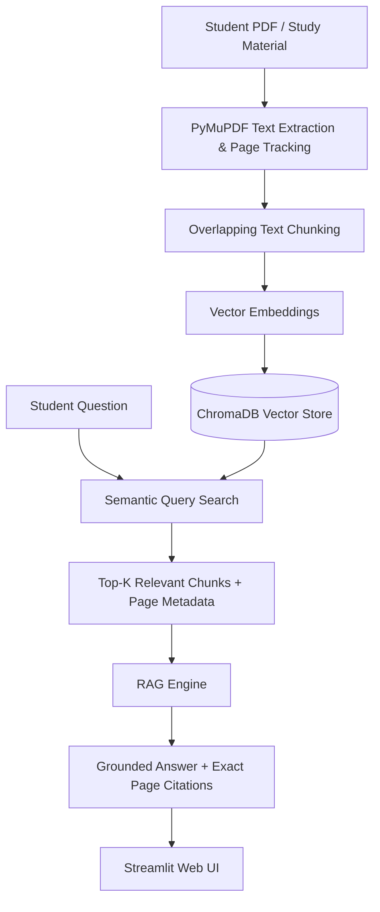

# 📚 AI-Powered RAG Study Assistant

A full-stack, portfolio-ready **Retrieval-Augmented Generation (RAG)** application designed to help students learn interactively from lecture notes, textbooks, and course PDFs.

The application ingests study documents, creates semantic vector embeddings, performs top-k similarity retrieval, and generates precise, grounded answers with exact source & page citations.

---

## 🌟 Key Features

* **📄 PDF Ingestion & Parsing:** Extracts structured text and preserves page numbers using PyMuPDF.
* **✂️ Intelligent Text Chunking:** Splits documents into overlapping chunks (~500 characters, 100 character overlap) to preserve semantic context across chunk boundaries.
* **🧠 Local Vector Embeddings:** Uses ChromaDB with built-in embeddings for instant offline retrieval without requiring third-party embedding API costs.
* **🔎 Semantic Similarity Retrieval:** Top-k nearest-neighbor search with cosine distance scoring.
* **🤖 Grounded AI Generation:**
  * **Claude Mode (via Anthropic API):** Conversational, hallucination-resistant answers with strict adherence to the provided context.
  * **Local Extractive Mode:** Operates out-of-the-box without an API key by extracting and formatting key passages with citations.
* **📌 Page Citations & Evidence:** Every answer links back to specific document pages and shows the exact retrieved text passages.
* **💻 Streamlit Web Interface:** Modern, responsive chat UI with multi-file PDF upload, knowledge base statistics, quick study prompts (summaries, quizzes, definitions), and conversation management.

---

## 🏗️ Architecture & Pipeline



---

## 🚀 Getting Started

### 1. Prerequisites
* Python 3.10+
* Git

### 2. Installation

Clone the repository and enter the directory:
```bash
git clone https://github.com/yourusername/rag-study-assistant.git
cd rag-study-assistant
```

Create and activate a virtual environment:
```bash
# Windows
python -m venv venv
venv\Scripts\activate

# macOS / Linux
python3 -m venv venv
source venv/bin/activate
```

Install dependencies:
```bash
pip install -r requirements.txt
```

### 3. (Optional) Configure Anthropic Claude API Key
Copy `.env.example` to `.env`:
```bash
copy .env.example .env
```
Edit `.env` and add your Anthropic API Key:
```env
ANTHROPIC_API_KEY=your_anthropic_api_key_here
```
*(Note: If you don't have an API key, the app automatically runs in **Local Retrieval Mode**! You can also enter a key at any time inside the web UI).*

---

## 🖥️ Running the Web Application

Launch the Streamlit web app:
```bash
streamlit run app.py
```
Open your browser at `http://localhost:8501`.

---

## 🧪 Running Tests & Evaluation

Run the unit and integration tests:

```bash
# 1. Test PDF Text Extraction
python -m tests.test_pdf_processor

# 2. Test Text Chunking
python -m tests.test_chunker

# 3. Test ChromaDB Vector Store
python -m tests.test_vector_store

# 4. Test RAG Engine Pipeline
python -m tests.test_rag_engine

# 5. Run Evaluation Suite
python -m tests.test_evaluation
```

---

## 📁 Project Structure

```
rag-study-assistant/
├── app/
│   ├── __init__.py
│   ├── pdf_processor.py      # PyMuPDF document extraction & page mapping
│   ├── text_chunker.py       # Overlapping sliding-window chunker
│   ├── vector_store.py       # ChromaDB vector index & similarity retrieval
│   └── rag_engine.py         # Grounded generation, citation tracking & LLM integration
├── tests/
│   ├── __init__.py
│   ├── test_pdf_processor.py # Extraction test
│   ├── test_chunker.py       # Chunking test
│   ├── test_vector_store.py  # Vector store test
│   ├── test_rag_engine.py    # End-to-end RAG test
│   └── test_evaluation.py    # Multi-query evaluation test
├── documents/
│   └── test.pdf              # Sample study PDF
├── chroma_db/                # Local persistent vector database (auto-created)
├── app.py                    # Streamlit web application
├── requirements.txt          # Python dependencies
├── .env.example              # Environment variable template
├── .gitignore                # Git ignore configuration
└── README.md                 # Project documentation
```

---

## 🛠️ Technology Stack

* **Language:** Python 3.13
* **LLM Engine:** Anthropic Claude (`claude-3-5-haiku` / `claude-3-5-sonnet`)
* **Vector Database:** ChromaDB
* **Document Parsing:** PyMuPDF (`fitz`)
* **Web Framework:** Streamlit
* **Environment Management:** python-dotenv
